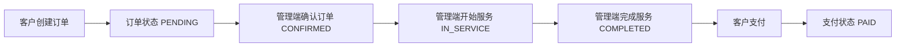

# 订单支付功能 PRD

## 1. 文档说明

本文档用于规划宠物订单系统的订单支付能力。目标是在现有“客户下单、管理端确认并完成服务、客户查看订单”的流程基础上，补齐客户侧支付入口和管理端支付反馈展示。

本期支付能力建议先按“模拟支付 / 线下支付确认”的轻量方案实现，先打通订单支付状态闭环；后续如需接入微信支付、支付宝或 Stripe 等第三方支付平台，可在本文档基础上扩展支付渠道、回调和对账能力。

## 2. 背景与问题

### 2.1 当前现状

系统当前已有两类订单：

1. 服务订单：客户在客户端订单管理中预约门店服务，管理端在订单管理中确认、开始服务、完成服务。
2. 托管订单：客户在客户端宠物托管中预约托管位置，管理端在宠物托管中管理入住、离店和托管状态。

现有订单主要记录业务状态和金额，例如：

- `PENDING`：待确认
- `CONFIRMED`：已确认
- `IN_SERVICE`：服务中
- `COMPLETED`：已完成
- `CANCELLED`：已取消
- `REJECTED`：已拒绝

但系统尚未记录订单是否已经付款，客户也无法在服务完成后进行支付，管理端无法区分“已完成但未支付”和“已完成且已支付”。

### 2.2 用户痛点

客户侧：

1. 客户完成服务后不知道哪些订单需要付款。
2. 客户订单列表只能看到业务状态，不能看到支付状态。
3. 客户不能在客户端完成支付动作。

管理端：

1. 管理员无法在订单列表中看到付款情况。
2. 已完成订单和已支付订单混在一起，影响财务核对。
3. 未支付订单缺少显性标识，不利于提醒客户或线下收款。

## 3. 产品目标

### 3.1 核心目标

1. 客户在客户端创建订单后，订单默认显示为“未支付”。
2. 管理端将订单业务状态更新为“已完成”后，客户可在客户端对该订单发起支付。
3. 客户完成支付后，客户端和管理端订单管理界面都显示“已支付”。
4. 未支付订单在客户端和管理端订单管理界面都显示“未支付”。
5. 支付状态与订单业务状态分开维护，避免把“已完成”和“已支付”混为一个状态。
6. 管理端财务数据收集和图表展示只统计已支付订单，未支付订单不进入收入、利润和趋势图表。

### 3.2 成功标准

1. 客户能在 3 秒内从订单列表识别哪些订单需要支付。
2. 客户只能支付“已完成且未支付”的订单。
3. 管理端订单列表能直接看到每笔订单的支付状态。
4. 已支付订单不能重复支付。
5. 已取消、已拒绝订单不能支付。
6. 支付成功后，刷新客户端和管理端列表均能看到最新支付状态。
7. 未支付订单不会计入管理端财务收入、利润、服务项目统计和趋势图表。

## 4. 用户角色

| 角色 | 权限 |
| --- | --- |
| 客户 | 查看自己的订单支付状态；对已完成且未支付的订单发起支付 |
| 管理员 | 查看所有订单支付状态；筛选未支付 / 已支付订单；查看支付时间和支付方式 |
| 高级管理员 | 拥有管理员能力；后续可扩展退款、支付异常处理、财务对账 |

## 5. 功能范围

### 5.1 本期必须实现

1. 服务订单新增支付状态字段。
2. 客户端订单管理列表展示支付状态。
3. 管理端订单管理列表展示支付状态。
4. 客户端在订单“已完成且未支付”时显示“支付”按钮。
5. 客户点击支付后进入支付确认弹窗。
6. 客户确认支付后，订单支付状态更新为“已支付”。
7. 支付成功后记录支付时间、支付方式和支付流水号。
8. 管理端订单管理支持按支付状态筛选。
9. 订单详情页展示支付信息。
10. 后端接口必须校验客户只能支付自己的订单。
11. 管理端财务模块统计口径调整为只纳入已支付订单。

### 5.2 本期暂不实现

1. 真实第三方支付网关接入。
2. 支付二维码、银行卡支付、微信支付、支付宝支付。
3. 退款流程。
4. 部分支付、拆单支付、合并支付。
5. 发票管理。
6. 自动对账。
7. 支付超时自动关闭。

这些能力建议在支付状态闭环稳定后作为二期迭代。

## 6. 核心规则

### 6.1 订单业务状态与支付状态分离

订单业务状态继续表示服务履约进度：

| 状态 | 说明 |
| --- | --- |
| PENDING | 待确认 |
| CONFIRMED | 已确认 |
| IN_SERVICE | 服务中 |
| COMPLETED | 已完成 |
| CANCELLED | 已取消 |
| REJECTED | 已拒绝 |

新增支付状态表示收款进度：

| 状态 | 展示文案 | 说明 |
| --- | --- | --- |
| UNPAID | 未支付 | 订单尚未付款 |
| PAID | 已支付 | 订单已付款 |

本期不引入 `REFUNDED`、`PARTIAL_PAID`、`PAYING` 等复杂状态。

### 6.2 支付入口展示规则

客户端订单管理中：

1. 订单业务状态为 `COMPLETED` 且支付状态为 `UNPAID` 时，显示“支付”按钮。
2. 订单业务状态不是 `COMPLETED` 时，不显示“支付”按钮。
3. 支付状态为 `PAID` 时，不显示“支付”按钮，显示“已支付”标签。
4. 订单状态为 `CANCELLED` 或 `REJECTED` 时，不允许支付。

管理端订单管理中：

1. 所有订单都展示支付状态列。
2. 未支付订单展示“未支付”标签。
3. 已支付订单展示“已支付”标签。
4. 支付状态支持筛选。
5. 本期管理端不提供代客支付按钮，避免误操作；如门店需要线下收款录入，可作为二期“线下收款确认”能力。

### 6.3 支付金额规则

1. 支付金额默认等于订单 `totalAmount`。
2. 客户支付前，弹窗展示订单号、宠物、服务内容、订单金额。
3. 支付提交时以后端订单金额为准，前端传入金额仅作展示，不作为最终入账依据。
4. 如果订单金额为 0，支付按钮可显示为“确认完成支付”，支付成功后同样标记为 `PAID`。

### 6.4 幂等规则

1. 已支付订单再次调用支付接口时，后端返回“订单已支付”，不重复生成支付记录。
2. 同一订单同时多次点击支付时，最终只能产生一条有效支付记录。
3. 支付接口必须基于数据库事务更新订单和支付记录。

### 6.5 财务统计入账规则

管理端财务模块必须以支付状态作为收入入账依据：

1. 只有 `payment_status = PAID` 的订单才进入财务数据收集。
2. 未支付订单不进入收入统计、利润统计、趋势图表、服务项目销售统计。
3. 已完成但未支付订单只能作为“待收款订单”展示，不能计入已收收入。
4. 财务模块中的营业收入、订单收入、毛利、利润率、趋势图表均基于已支付订单计算。
5. 支付成功后，该订单从下一次财务接口查询开始进入财务统计。
6. 如果后续支持退款，退款成功后应从财务收入中冲减，本期暂不实现。

## 7. 页面设计

### 7.1 客户端订单管理

页面路径：`/my-orders`

#### 列表新增内容

在现有订单列表中新增“支付状态”列：

| 列名 | 内容 |
| --- | --- |
| 支付状态 | 未支付 / 已支付 |

建议展示样式：

- 未支付：橙色 `el-tag`，文案“未支付”。
- 已支付：绿色 `el-tag`，文案“已支付”。

#### 操作列新增按钮

当订单满足以下条件时展示“支付”按钮：

- `status === 'COMPLETED'`
- `paymentStatus === 'UNPAID'`

点击“支付”后打开支付确认弹窗。

#### 支付确认弹窗

弹窗标题：`订单支付`

弹窗内容：

1. 订单号。
2. 宠物名称。
3. 服务项目。
4. 订单金额。
5. 支付方式：本期默认“模拟支付”或“线下支付确认”。

按钮：

1. 取消。
2. 确认支付。

支付成功提示：`支付成功`

支付成功后：

1. 关闭弹窗。
2. 刷新订单列表。
3. 当前订单支付状态显示为“已支付”。
4. 操作列不再显示“支付”按钮。

### 7.2 管理端订单管理

页面路径：`/orders`

#### 筛选区新增字段

新增筛选项：

| 筛选项 | 可选值 |
| --- | --- |
| 支付状态 | 全部、未支付、已支付 |

#### 列表新增列

在“订单金额”和“状态”之间新增“支付状态”列。

| 列名 | 内容 |
| --- | --- |
| 支付状态 | 未支付 / 已支付 |

#### 详情页新增支付信息

订单详情页 `/orders/:id` 新增支付信息区：

1. 支付状态。
2. 支付金额。
3. 支付方式。
4. 支付流水号。
5. 支付时间。

未支付时展示：

- 支付状态：未支付
- 其他字段：`-`

已支付时展示真实支付记录。

## 8. 后端设计

### 8.1 数据模型

#### 8.1.1 service_order 表新增字段

建议在 `service_order` 表增加字段：

```sql
alter table service_order add column payment_status text not null default 'UNPAID';
alter table service_order add column paid_amount numeric not null default 0;
alter table service_order add column paid_at text;
alter table service_order add column payment_method text;
alter table service_order add column payment_no text;
```

字段说明：

| 字段 | 类型 | 默认值 | 说明 |
| --- | --- | --- | --- |
| payment_status | text | UNPAID | 支付状态，UNPAID / PAID |
| paid_amount | numeric | 0 | 已支付金额 |
| paid_at | text | null | 支付时间 |
| payment_method | text | null | 支付方式 |
| payment_no | text | null | 支付流水号 |

建议增加索引：

```sql
create index if not exists idx_service_order_payment_status on service_order(payment_status);
create unique index if not exists uk_service_order_payment_no on service_order(payment_no) where payment_no is not null;
```

#### 8.1.2 可选：payment_record 表

如果希望保留支付流水，建议新增支付记录表：

```sql
create table if not exists payment_record (
    id integer primary key autoincrement,
    order_type text not null,
    order_id integer not null,
    payment_no text not null unique,
    amount numeric not null,
    payment_method text not null,
    payment_status text not null,
    paid_by_account_id integer not null,
    paid_at text,
    created_at text not null default (datetime('now', 'localtime')),
    updated_at text not null default (datetime('now', 'localtime'))
);

create index if not exists idx_payment_record_order on payment_record(order_type, order_id);
create index if not exists idx_payment_record_status on payment_record(payment_status);
```

本期可以只在 `service_order` 上保存支付状态；如果预计后续会做退款、对账、支付异常，建议直接增加 `payment_record` 表。

### 8.2 接口设计

#### 8.2.1 客户支付订单

接口：

```http
POST /api/my-orders/{id}/pay
```

请求体：

```json
{
  "paymentMethod": "MOCK"
}
```

响应：

```json
{
  "code": 0,
  "message": "success",
  "data": {
    "orderId": 1,
    "orderNo": "SO202608140001",
    "paymentStatus": "PAID",
    "paidAmount": 199.00,
    "paymentMethod": "MOCK",
    "paymentNo": "PAY202608140001",
    "paidAt": "2026-08-14 10:30:00"
  }
}
```

后端校验：

1. 当前登录用户必须是客户。
2. 订单必须属于当前客户。
3. 订单必须存在。
4. 订单业务状态必须为 `COMPLETED`。
5. 订单支付状态必须为 `UNPAID`。
6. 支付金额以后端 `totalAmount` 为准。

错误提示：

| 场景 | 提示 |
| --- | --- |
| 订单不存在 | 订单不存在 |
| 非本人订单 | 无权限支付该订单 |
| 订单未完成 | 订单完成后才可支付 |
| 已支付 | 订单已支付 |
| 已取消 / 已拒绝 | 该订单不可支付 |

#### 8.2.2 管理端订单列表

接口：

```http
GET /api/orders
```

新增查询参数：

| 参数 | 说明 |
| --- | --- |
| paymentStatus | 支付状态，UNPAID / PAID |

返回列表新增字段：

```json
{
  "paymentStatus": "UNPAID",
  "paidAmount": 0,
  "paymentMethod": null,
  "paymentNo": null,
  "paidAt": null
}
```

#### 8.2.3 客户端订单列表

接口：

```http
GET /api/my-orders
```

返回列表新增字段与管理端一致。

#### 8.2.4 订单详情

接口：

```http
GET /api/orders/{id}
```

返回详情新增支付字段：

1. `paymentStatus`
2. `paidAmount`
3. `paymentMethod`
4. `paymentNo`
5. `paidAt`

## 9. 前端改造点

### 9.1 API

`frontend/src/api/orders.js` 增加：

```js
export function payMyOrder(id, data) {
  return http.post(`/my-orders/${id}/pay`, data)
}
```

订单列表接口查询参数增加 `paymentStatus`。

### 9.2 客户端订单管理

文件：`frontend/src/views/MyOrdersView.vue`

改造点：

1. 查询条件增加支付状态筛选。
2. 表格增加“支付状态”列。
3. 操作列在满足条件时显示“支付”按钮。
4. 新增支付确认弹窗。
5. 支付成功后调用 `loadOrders()` 刷新列表。

### 9.3 管理端订单管理

文件：`frontend/src/views/OrdersView.vue`

改造点：

1. 查询条件增加支付状态筛选。
2. 表格增加“支付状态”列。
3. 列表记录显示未支付 / 已支付。
4. 订单详情入口保持不变。

### 9.4 订单详情页

文件：`frontend/src/views/OrderDetailView.vue`

改造点：

1. 新增支付信息卡片或描述列表。
2. 已支付展示支付流水和支付时间。
3. 未支付展示空状态。

## 10. 状态流转

### 10.1 正常流程



订单创建后：

- `status = PENDING`
- `paymentStatus = UNPAID`

订单完成后：

- `status = COMPLETED`
- `paymentStatus = UNPAID`
- 客户端显示“支付”按钮

支付成功后：

- `status = COMPLETED`
- `paymentStatus = PAID`

### 10.2 异常流程

| 场景 | 规则 |
| --- | --- |
| 管理端取消订单 | 如果未支付，保持 UNPAID；不允许客户支付 |
| 管理端拒绝订单 | 保持 UNPAID；不允许客户支付 |
| 客户取消订单 | 保持 UNPAID；不允许支付 |
| 已支付订单被误操作 | 本期不支持取消已支付订单；二期通过退款流程处理 |

## 11. 数据展示文案

### 11.1 支付状态文案

| paymentStatus | 文案 | 标签建议 |
| --- | --- | --- |
| UNPAID | 未支付 | warning |
| PAID | 已支付 | success |

### 11.2 按钮文案

| 场景 | 按钮 |
| --- | --- |
| 客户端已完成未支付订单 | 支付 |
| 支付弹窗确认 | 确认支付 |
| 支付弹窗取消 | 取消 |

### 11.3 提示文案

| 场景 | 提示 |
| --- | --- |
| 支付成功 | 支付成功 |
| 已支付再次支付 | 订单已支付 |
| 未完成订单支付 | 订单完成后才可支付 |
| 非本人订单支付 | 无权限支付该订单 |

## 12. 埋点与运营指标

本期如暂不做埋点，可先预留指标口径：

1. 待支付订单数。
2. 已支付订单数。
3. 支付完成率：已支付订单数 / 已完成订单数。
4. 平均支付耗时：支付时间 - 订单完成时间。
5. 管理端未支付筛选使用次数。
6. 已支付收入金额。
7. 未支付待收款金额。
8. 财务图表收入金额，口径必须等于已支付订单金额汇总。

## 13. 验收标准

### 13.1 客户端

1. 客户新建订单成功后，订单列表显示支付状态为“未支付”。
2. 管理端将订单更新为“已完成”前，客户端不显示支付按钮。
3. 管理端将订单更新为“已完成”后，客户端显示支付按钮。
4. 客户点击支付并确认后，订单显示“已支付”。
5. 已支付订单刷新页面后仍显示“已支付”。
6. 已支付订单不再显示支付按钮。

### 13.2 管理端

1. 管理端订单列表展示支付状态列。
2. 未支付订单显示“未支付”。
3. 已支付订单显示“已支付”。
4. 管理端可按支付状态筛选订单。
5. 客户完成支付后，管理端刷新列表可看到该订单变为“已支付”。
6. 订单详情页可看到支付时间、支付方式、支付流水号。
7. 管理端财务图表只展示已支付订单产生的收入和利润。
8. 已完成但未支付订单不会出现在财务收入统计中。

### 13.3 后端

1. 订单创建时默认 `payment_status = UNPAID`。
2. 支付接口只能支付当前客户自己的订单。
3. 非 `COMPLETED` 订单调用支付接口会失败。
4. 已支付订单重复调用支付接口不会重复入账。
5. 支付成功后订单支付字段和支付记录一致。
6. 财务统计接口必须过滤 `payment_status = PAID`，不能统计未支付订单。

## 14. 分阶段执行计划

支付功能建议按“先闭环、再增强、后接真实支付”的节奏推进。每个阶段都应能独立验收，避免一次性改造过大导致订单主流程不稳定。

### 14.1 阶段一：支付状态基础闭环

阶段目标：

先让系统具备“订单是否已支付”的基础判断能力，并让客户端和管理端都能看到一致的支付状态。本阶段不做真实支付，只实现模拟支付。

实施范围：

1. `service_order` 增加支付字段：`payment_status`、`paid_amount`、`paid_at`、`payment_method`、`payment_no`。
2. 后端订单实体、列表视图、详情视图增加支付字段。
3. 订单创建时默认写入 `payment_status = UNPAID`。
4. 客户端订单列表展示“支付状态”列。
5. 管理端订单列表展示“支付状态”列。
6. 管理端订单列表支持按 `paymentStatus` 筛选。
7. 暂不提供支付按钮，只先展示支付状态。

交付物：

1. 数据库迁移脚本。
2. 后端订单列表和详情接口返回支付字段。
3. 客户端订单管理页面展示“未支付 / 已支付”。
4. 管理端订单管理页面展示“未支付 / 已支付”。
5. 管理端支付状态筛选项。

验收标准：

1. 新建订单后，客户端和管理端都显示“未支付”。
2. 订单业务状态变化不影响支付状态。
3. 管理端可筛选未支付订单。
4. 刷新页面后支付状态仍正确展示。

建议优先级：

P0，必须先做。

风险点：

1. 旧订单没有支付字段时必须默认兼容为 `UNPAID`。
2. 列表视图同时包含服务订单和托管订单时，需要明确本阶段只处理服务订单，托管订单先保持不变或统一展示为 `UNPAID`。

### 14.2 阶段二：客户模拟支付闭环

阶段目标：

客户在订单完成后可以主动点击支付，支付成功后客户端和管理端都能看到“已支付”。

实施范围：

1. 新增客户支付接口：`POST /api/my-orders/{id}/pay`。
2. 后端校验订单归属、订单状态、支付状态。
3. 客户端订单管理在“已完成且未支付”订单上展示“支付”按钮。
4. 客户点击“支付”后打开支付确认弹窗。
5. 支付成功后更新订单支付字段。
6. 支付成功后刷新客户端订单列表。
7. 管理端刷新订单列表后可看到“已支付”。

交付物：

1. 客户支付接口。
2. 支付请求对象和支付结果对象。
3. 客户端支付确认弹窗。
4. 客户端支付按钮展示规则。
5. 支付成功提示和列表刷新。

验收标准：

1. 未完成订单不显示支付按钮。
2. 已完成且未支付订单显示支付按钮。
3. 客户不能支付别人的订单。
4. 已支付订单不能重复支付。
5. 支付成功后客户端显示“已支付”。
6. 支付成功后管理端显示“已支付”。

建议优先级：

P0，阶段一完成后立即实施。

风险点：

1. 支付接口必须加事务，避免重复点击导致重复流水。
2. 前端按钮显示不能替代后端校验。
3. 支付金额必须以后端订单金额为准。

### 14.3 阶段三：订单详情和管理端反馈增强

阶段目标：

让管理端能更清楚地查看支付详情，便于门店运营和财务核对。

实施范围：

1. 订单详情页新增支付信息区。
2. 管理端订单列表展示支付时间或支付方式。
3. 客户端订单详情或列表弹窗展示支付结果。
4. 增加支付状态文案统一映射。
5. 增加支付异常提示文案。

交付物：

1. 订单详情支付信息模块。
2. 支付状态展示组件或统一映射方法。
3. 管理端支付信息展示。
4. 客户端支付结果展示。

验收标准：

1. 未支付订单详情显示支付状态为“未支付”，支付时间、流水号为空。
2. 已支付订单详情显示支付时间、支付方式、支付流水号。
3. 管理端能从列表或详情中判断订单是否已支付。
4. 客户端能看到支付成功后的结果信息。

建议优先级：

P1，阶段二完成后实施。

风险点：

1. 详情页字段为空时需要有良好空状态，避免展示 `null`。
2. 支付流水号生成规则需要保证唯一。

### 14.4 阶段四：支付记录表和财务扩展

阶段目标：

从“订单字段记录支付结果”升级为“支付记录可追溯”，为后续退款、对账、真实支付渠道接入做准备。

实施范围：

1. 新增 `payment_record` 表。
2. 支付成功时同时写入订单支付字段和支付记录。
3. 管理端订单详情展示支付记录。
4. 财务管理页面可统计已支付金额、未支付待收款金额。
5. 管理端增加未支付订单快捷筛选或提醒。
6. 财务管理页面的收入、利润和趋势图表只基于已支付订单生成。

交付物：

1. 支付记录表。
2. 支付记录实体和 Mapper。
3. 支付记录写入逻辑。
4. 管理端支付记录展示。
5. 财务统计口径更新。
6. 财务图表过滤未支付订单。

验收标准：

1. 每次支付成功都能生成一条支付记录。
2. 支付记录和订单支付字段一致。
3. 管理端可查看支付流水号、支付方式、支付金额、支付时间。
4. 财务页面能区分应收、已收、未收。
5. 财务收入、利润、趋势图表只统计已支付订单。
6. 已完成但未支付订单只进入待收款提醒，不进入财务图表。

建议优先级：

P1 / P2，取决于是否近期要做财务统计。

风险点：

1. 如果阶段一和阶段二未引入支付记录表，阶段四需要补历史数据。
2. 支付记录和订单支付字段需要保持事务一致。
3. 财务模块历史统计 SQL 需要同步改造，避免仍按订单完成状态统计收入。

### 14.5 阶段五：真实支付渠道接入

阶段目标：

接入真实支付能力，让客户能够通过微信支付、支付宝或其他支付平台完成线上支付。

实施范围：

1. 选择支付渠道：微信支付、支付宝或其他。
2. 新增创建支付单接口。
3. 新增支付回调接口。
4. 支付成功以后端回调为准更新支付状态。
5. 客户端展示支付二维码或跳转支付页。
6. 增加支付中、支付失败、支付超时状态。
7. 增加支付回调验签和幂等处理。

交付物：

1. 第三方支付配置。
2. 支付单创建接口。
3. 支付回调接口。
4. 支付二维码或跳转支付页面。
5. 支付状态轮询或刷新机制。
6. 支付安全校验和日志。

验收标准：

1. 客户能完成真实支付。
2. 支付平台回调成功后，系统订单变为“已支付”。
3. 客户端和管理端展示一致。
4. 重复回调不会重复入账。
5. 支付失败或取消时订单仍为“未支付”。

建议优先级：

P2，等模拟支付闭环和财务口径稳定后再做。

风险点：

1. 支付渠道需要商户号、证书、密钥等配置。
2. 回调接口必须公网可访问。
3. 真实支付涉及资金安全，必须增加验签、日志和异常处理。

### 14.6 阶段六：退款和异常处理

阶段目标：

补齐已支付订单取消、退款、支付异常处理能力，形成完整资金闭环。

实施范围：

1. 增加退款状态：`REFUNDED`、`REFUNDING`、`REFUND_FAILED`。
2. 增加退款记录表或扩展支付记录表。
3. 管理端发起退款。
4. 客户端展示退款状态。
5. 财务管理增加退款金额统计。
6. 支付异常订单支持人工标记和备注。

交付物：

1. 退款接口。
2. 退款记录。
3. 管理端退款操作入口。
4. 客户端退款状态展示。
5. 财务退款统计。

验收标准：

1. 已支付订单可由管理端发起退款。
2. 退款成功后客户端和管理端展示一致。
3. 退款金额进入财务统计。
4. 退款失败有明确错误提示和人工处理入口。

建议优先级：

P3，真实支付上线后再实施。

风险点：

1. 退款强依赖真实支付渠道。
2. 退款和订单取消规则需要门店业务确认。
3. 涉及资金反向流转，需要更严格的权限控制。

### 14.7 推荐落地顺序

推荐按以下顺序执行：

1. 阶段一：支付状态基础闭环。
2. 阶段二：客户模拟支付闭环。
3. 阶段三：订单详情和管理端反馈增强。
4. 阶段四：支付记录表和财务扩展。
5. 阶段五：真实支付渠道接入。
6. 阶段六：退款和异常处理。

如果当前只是课程、演示或内部管理系统，建议先完成阶段一到阶段三即可；如果要投入真实门店使用，建议至少完成阶段一到阶段四，再评估真实支付接入。

## 15. 后续扩展

二期可考虑：

1. 接入微信支付、支付宝等真实支付渠道。
2. 增加支付二维码。
3. 增加退款状态和退款记录。
4. 增加管理端线下收款确认。
5. 增加财务对账页面。
6. 增加客户支付成功通知。
7. 将托管订单 `boarding_order` 同步纳入统一支付能力。
